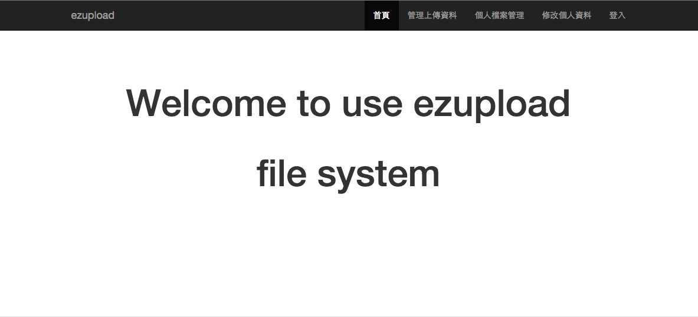
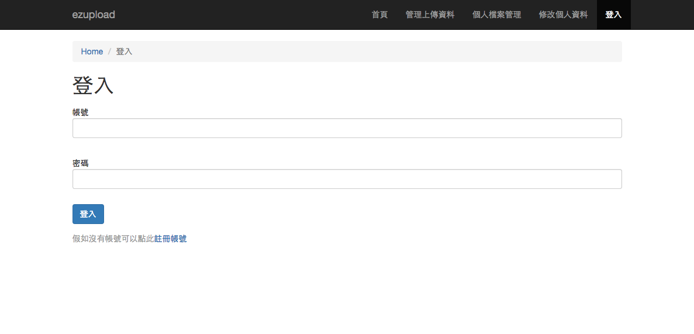
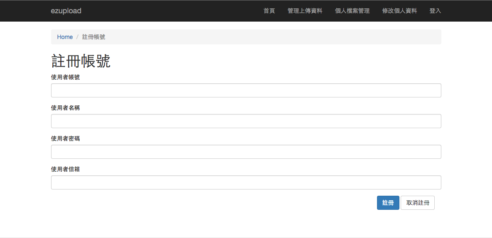
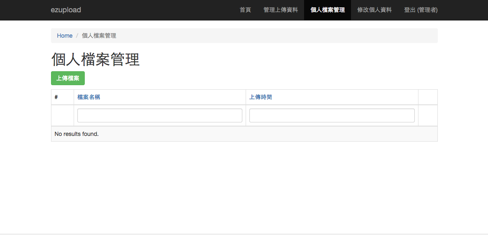

#ezupload檔案上傳系統
-
ezupload檔案上傳系統是一個簡易的檔案上傳系統，提供了使用者註冊與上傳並管理自己檔案功能，而管理者也可以輕易的管理所有上傳的檔案，該系統可以快速的建立並應用於研討會論文上傳管理或學生專題檔案上傳管理之用。

##建置教學

1. php版本需要5.4以上

2. 下載壓縮檔後解壓縮放置您的網站目錄，如 ``` /var/www/html ```

3. 先新增資料庫後，再將此資料庫語法貼上phpmyadmin或資料庫管理工具新增資料表單
	
	``` sql
	
	DROP TABLE IF EXISTS 'ez_filepath';
	
	CREATE TABLE 'ez_filepath' (
  		'id' int(11) unsigned NOT NULL AUTO_INCREMENT COMMENT '檔案序號',
  		'userid' int(11) NOT NULL COMMENT '使用者序號',
  		'filename' varchar(255) DEFAULT '' COMMENT '檔案名稱',
  		'filepath' varchar(255) DEFAULT '' COMMENT '檔案路徑',
  		'uploaddate' timestamp NOT NULL DEFAULT CURRENT_TIMESTAMP ON UPDATE CURRENT_TIMESTAMP COMMENT '上傳時間',
  		PRIMARY KEY ('id'),
  		KEY 'userid' ('userid')
	) ENGINE=InnoDB DEFAULT CHARSET=utf8;
	
	DROP TABLE IF EXISTS 'ez_user';

	CREATE TABLE 'ez_user' (
  		'id' int(11) unsigned NOT NULL AUTO_INCREMENT COMMENT '使用者序號',
  		'account' varchar(20) NOT NULL DEFAULT '' COMMENT '使用者帳號',
  		'password' varchar(255) NOT NULL DEFAULT '' COMMENT '使用者密碼',
  		'username' varchar(11) NOT NULL DEFAULT '' COMMENT '使用者名稱',
  		'email' varchar(100) NOT NULL DEFAULT '' COMMENT '使用者信箱',
  		'role' varchar(1) DEFAULT NULL COMMENT '使用者角色',
  		PRIMARY KEY ('id'),
  		KEY 'account' ('account')
	) ENGINE=InnoDB DEFAULT CHARSET=utf8;

	LOCK TABLES 'ez_user' WRITE;

	INSERT INTO 'ez_user' ('id', 'account', 'password', 'username', 		'email', 'role')
	VALUES
(1,'admin','8d5f8aeeb64e3ce20b537d04c486407eaf489646617cfcf493e76f5b794fa080','管理者','admin@example.com','*');

	UNLOCK TABLES;
	
	```
4. 修改檔案目錄權限為可以讀寫，其目錄為 ``` <your project name>/web ```

5. 開啟終端機輸入以下指令安裝系統需要的套件 ``` composer install ```

6. 修改資料庫連線設定，開啟 ``` <your project name>/config/db.php ``` 設定資料庫連線ip、資料庫名稱、使用者帳號與密碼

7. 開啟瀏覽器輸入 ``` http:\\localhost\<your project name>\web ``` 就可以開啟系統，管理者登入帳密為admin/admin

## 系統圖片










## 版權說明

The MIT License (MIT)